<picture>
  <source media="(prefers-color-scheme: dark)" srcset="assets/header-dark.svg">
  
</picture>

  <a href="https://im-kaami.github.io">Website</a>&nbsp;&nbsp;&middot;&nbsp;&nbsp;<a href="https://linkedin.com/in/ikram-hafeez">LinkedIn</a>&nbsp;&nbsp;&middot;&nbsp;&nbsp;<a href="mailto:hafeez.muhammadikram@outlook.com">Email</a>

 

I'm a Computer Science & Engineering student in Budapest, working where data meets AI. In industry I automate reporting and build Power BI dashboards at [Xerox](https://www.xerox.com); in research I study how language models read biomedical science at [Óbuda University](https://uni-obuda.hu). On the side I build LLM tools (agents, RAG assistants and fact-checkers) and mentor students.

**Interested in** &nbsp;AI for science & biomedical NLP · LLM evaluation · efficient fine-tuning (LoRA/PEFT) · LLM agents & RAG · data science & analytics · workflow automation

### Now

- **Industry** &nbsp;·&nbsp; reporting automation and Power BI dashboards for EMEA operations at Xerox
- **Research** &nbsp;·&nbsp; multi-label sequential sentence classification with LLMs, LoRA and PEFT
- **Learning** &nbsp;·&nbsp; AWS AI & ML Scholars Nanodegree with Udacity, through November 2026
- **Mentoring** &nbsp;·&nbsp; high-school students at Milestone Institute and international students with HÖOK

### Research

<picture>
  <source media="(prefers-color-scheme: dark)" srcset="assets/research-dark.svg">
  
</picture>

### Selected work

| Project | What it does |
| :-- | :-- |
| **[InsightForge AI](https://github.com/im-kaami/InsightForgeAI)** AI analytics agent · Personal | Turns a business question into a plan, SQL, a chart and an executive summary, with a full reasoning trace. GPT-4o-mini · DuckDB · Matplotlib · Gemini |
| **[VeriVision](https://github.com/mariasiles/VeriVision)** Fact-checking · HPI Potsdam · 2026 | Claim-level verification of text or a social-media video link, returning a verdict with ranked sources. Built by an international team in four days. Python · FastAPI · React · OpenAI · Tavily · faster-whisper |
| **Campus Copilot** RAG assistant · Óbuda AI Campus | Answers students' questions from university sources, grounding each answer in retrieved passages to reduce hallucination. RAG · LLMs · Retrieval |
| **[AI Earphone](https://github.com/LiRongchuan/raspbot-public)** Assistive wearable · SUSTech · 2025 | An earphone for elderly users with fall detection, PPG heart-rate monitoring, a voice assistant and adaptive noise reduction. Sensors · PPG · Voice AI · UX research |
| **[AI Salary Prediction](https://github.com/im-kaami/ISSP25-Project)** Explainable ML · University of Prizren · 2025 | A Random Forest regressor for cybersecurity salaries, explained with SHAP and explored through an interactive dashboard. scikit-learn · SHAP · Dash · Plotly |

More on <a href="https://im-kaami.github.io/projects.html">im-kaami.github.io/projects</a>

### Experience

| Role | Organisation | Period |
| :-- | :-- | :-- |
| **Automation & Data Analytics Intern** | Xerox Hungary Competence Centre | Aug 2025 – now |
| **AI Research Assistant** | Óbuda University, Applied ML Research Group | Sep 2025 – now |
| **Student Mentor** | Milestone Institute | Apr 2026 – now |
| **International Students Mentor** | HÖOK | Jul 2024 – now |
| **Sustainability Data Analyst Intern** | Givaudan | Sep 2024 – Feb 2025 |

### Education

| Programme | Institution | Grade |
| :-- | :-- | :-- |
| **BSc Computer Science & Engineering** | Óbuda University, Budapest · 2022 – 2027 | 4.71 / 5 |
| **Short Diploma, Data Science with AI** | NED University of Engineering and Technology · 2025 – now | 3.87 / 4 |

Summer schools: Machine Learning in Solar and Planetary Research (Europlanet, Bulgaria) · ICT Summer School (Metropolia, Helsinki) · European Impact Sprint (HPI, Potsdam) · Shokz Global Talent Summer School (SUSTech, Shenzhen) · International Summer School in AI (University of Prizren)

Scholarships: Stipendium Hungaricum · Pannonia · Youth Envoy, SUSTech · PEEF

### Skills

| Area | Tools |
| :-- | :-- |
| **AI & Data Science** | Python · PyTorch · Transformers · scikit-learn · LoRA / PEFT · RAG · agents |
| **Analytics & BI** | SQL · Power BI · DAX · DuckDB · Pandas · Plotly |
| **Automation** | Power Automate · Excel VBA · SharePoint · SAP · Microsoft 365 |
| **Engineering** | C# · .NET · Azure · AWS · Git · Linux |

 

Budapest, Hungary &nbsp;·&nbsp; Open to research and industry roles in AI & data

